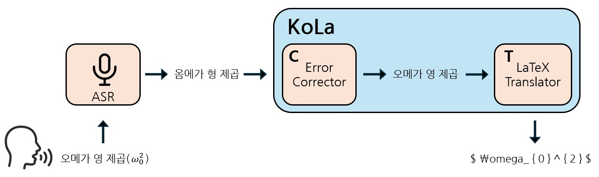

# KoLa: Korean speech to Latex extraction Using small LM Modules

[COSE461] 2025-1 Korea Univeristy NLP Project

This is an course term project in [COSE451] Natural Language Processing (Pf. Byungjun Lee)

----
## Abstract
We introduce KoLa, a lightweight, modular pipeline designed to translate Korean mathematical speech directly into LaTeX expressions. Central to our contribution is KoTeX-100K, KoTeX-400K a newly constructed dataset containing 100,000 aligned triples of Korean mathematical speech audio, textual transcriptions, and corresponding \LaTeX formulas. KoLa utilizes a Whisper-based ASR module followed sequentially by two compact modules: a text-based Error Corrector and a LaTeX Translator. Both modules are independently trained on KoTeX 100K, KoTeX 400K enabling robust correction of ASR errors and flexible improvement of formula transcription quality. Our findings demonstrate the feasibility of high-quality mathematical speech transcription in Korean, highlighting opportunities for extending this approach to multilingual mathematical speech understanding. We publicly release our code and dataset to facilitate further research.

